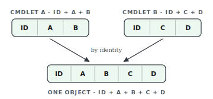

# JoinObject

PowerShell's pipeline lets you write remarkably elegant one-liners. As long as you stay within a single cmdlet's output, life is good:

```powershell
Get-Mailbox -RecipientTypeDetails SharedMailbox |
    Get-MailboxStatistics |
    Select-Object DisplayName, TotalItemSize
```

But the moment you need values from **two different cmdlets** in the same result, that elegance falls apart. `Get-MailboxStatistics` returns its *own* objects — the `Department`, `Office` or `PrimarySmtpAddress` you had on the `Get-Mailbox` object are gone. You're left with two awkward workarounds:

**1. Buffer everything in a loop:**

```powershell
$report = foreach ($mbx in Get-Mailbox -RecipientTypeDetails SharedMailbox) {
    $stats = Get-MailboxStatistics -Identity $mbx.PrimarySmtpAddress
    [pscustomobject]@{
        DisplayName   = $mbx.DisplayName
        Department    = $mbx.Department
        TotalItemSize = $stats.TotalItemSize
        ItemCount     = $stats.ItemCount
    }
}
```

**2. Or reach back out with computed properties:**

```powershell
Get-Mailbox -RecipientTypeDetails SharedMailbox |
    Select-Object DisplayName, Department,
        @{ Name = 'TotalItemSize'; Expression = { (Get-MailboxStatistics -Identity $_.PrimarySmtpAddress).TotalItemSize } },
        @{ Name = 'ItemCount';     Expression = { (Get-MailboxStatistics -Identity $_.PrimarySmtpAddress).ItemCount } }
```

Both work, but both hurt: the loop throws the pipeline away, and the computed properties call `Get-MailboxStatistics` *once per column* — the same expensive lookup, over and over.

## Enter Join-Object

<p align="center">
  
</p>

`Join-Object` (alias **`Join`**) brings the join back into the pipeline. For each object it finds a shared identity (like `PrimarySmtpAddress` or a GUID), calls the second cmdlet **once**, and merges both results into a single object — so you just keep piping:

```powershell
# Everything above, in one readable line:
Get-Mailbox -RecipientTypeDetails SharedMailbox |
    Join-Object Get-MailboxStatistics |
    Select-Object DisplayName, Department, TotalItemSize, ItemCount
```

```powershell
# It works for any pair of cmdlets that share an identity — e.g. services and their processes:
Get-Service |
    Join Get-Process -IdentityProperty Name |
    Select-Object Name, Status, CPU, WorkingSet
```

`Join-Object` calls also chain, so you can pull data from three (or more) cmdlets in one pipeline:

```powershell
# Mailbox -> mailbox statistics -> AD user, joined in a single readable chain:
Get-RemoteMailbox |
    Join-Object Get-MailboxStatistics |
    Join-Object Get-ADUser -IdentityProperty SamAccountName |
    Select-Object Prim*, TotalItemSize, Enabled
```

No buffering, no repeated lookups, no computed-property gymnastics — just one pipe.

### Beta: script-block support

`Cmdlet` also accepts a script block instead of a cmdlet name. The full input object is exposed as `$_`, giving you complete control over the enrichment call — no identity discovery or auto-splatting in this mode:

```powershell
Get-RemoteMailbox |
    Join-Object { Get-Mailbox -Identity $_.PrimarySmtpAddress -ErrorAction SilentlyContinue }
```

## Stable vs. Beta

This repository tracks two parallel versions so you can pick what fits your needs:

| Track      | Branch               | Latest release                                                                                  | Notes                                                |
| ---------- | --------------------- | ------------------------------------------------------------------------------------------------ | ----------------------------------------------------- |
| **Stable** | `main`                 | [v0.1.1](https://github.com/kreisi-dev/Join-Object/releases/tag/v0.1.1)                         | Recommended for production use.                       |
| **Beta**   | `ScriptBlockSupport`   | [v0.2.0-beta.2](https://github.com/kreisi-dev/Join-Object/releases/tag/v0.2.0-beta.2)           | **You are here.** Adds script-block support for `Cmdlet`. |

Check the [Releases page](https://github.com/kreisi-dev/Join-Object/releases) for the full list, including all prereleases. Beta releases are marked **Pre-release** on GitHub and are never the "Latest" release — install or clone them explicitly if you want to try upcoming features early.

## Installation

Clone the repository and import the module:

```powershell
git clone <repository-url> JoinObject
Import-Module ./JoinObject/JoinObject.psd1
```

## More examples

```powershell
# Pass extra parameters to the target cmdlet via -Options, e.g. to suppress errors
Get-ADUser -Filter "Name -like 'John*'" |
    Join-Object Get-Mailbox -Options @{ ErrorAction = 'SilentlyContinue' }

# -With is an alias for -Options; -Force overwrites existing fields instead of
# suffixing collisions with _2, _3, ...
$Data | Join-Object Get-ADUser -With @{ Properties = 'Department', 'Office' } -Force
```

Full help is available after import:

```powershell
Get-Help Join-Object -Full
```

## Parameters (overview)

| Parameter          | Description                                                                  |
| ------------------ | ---------------------------------------------------------------------------- |
| `Cmdlet`           | Name of the cmdlet called to enrich the data.                                |
| `InputObject`      | The object coming from the pipeline.                                         |
| `IdentityProperty` | Optional: explicit identity property of the input object.                    |
| `Options`          | Hashtable of additional parameters for the target cmdlet (alias: `With`).    |
| `Force`            | Overwrites existing properties instead of suffixing them with `_2`, `_3`, ... |

## Project structure

```
JoinObject/
├── JoinObject.psd1           # Module manifest
├── JoinObject.psm1           # Loader for the public functions
├── src/
│   └── Public/
│       └── Join-Object.ps1   # Implementation of Join-Object (alias: Join)
└── tests/
    └── Join-Object.Tests.ps1 # Pester tests
```

## Testing

Tests are written with [Pester](https://pester.dev) (5.x):

```powershell
Invoke-Pester -Path ./tests
```

## Requirements

- PowerShell 5.1 or later
- Pester 5.x (for running the tests)

## License

Released under the MIT License — see [LICENSE](LICENSE).
